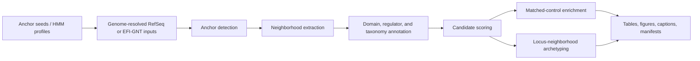

# GasRegNet

[](https://github.com/filiprumenovski/GasRegNet/actions/workflows/ci.yml)

GasRegNet is a comparative genomics workflow for nominating bacterial
gas-response regulator candidates from genome neighborhoods.

The core idea is simple: genes that metabolize or tolerate gases are often
embedded in local operon-like contexts. If a regulator repeatedly appears near a
gas-associated anchor gene, carries plausible DNA-binding or sensory domains,
and is enriched relative to matched controls, it becomes a candidate regulator
worth following experimentally.

GasRegNet turns that idea into a reproducible pipeline:



## Contents

- [Why GasRegNet](#why-gasregnet)
- [Repository Status](#repository-status)
- [Installation](#installation)
- [Quickstart](#quickstart)
- [Workflows](#workflows)
- [Configuration](#configuration)
- [Data Products](#data-products)
- [Scoring Model](#scoring-model)
- [Interpreting Results](#interpreting-results)
- [Command Reference](#command-reference)
- [Development](#development)
- [Repository Layout](#repository-layout)

## Why GasRegNet

Most genome-neighborhood tools can show that a gene sits near other genes.
GasRegNet is built for the next layer: turning repeated local context into a
ranked list of regulator hypotheses while preserving enough provenance to audit
why a candidate was nominated.

The workflow is designed around four constraints:

1. Gas-response biology is family-specific. `coxL`, `cooS`, `hmp`, `norB`,
   `fixL`, `fnr`, `hemAT`, cyanide-handling enzymes, and cytochrome bd control
   should not be collapsed into one generic “gas” bucket.
2. Genome coordinates matter. Sequence databases can find homologs, but they
   cannot prove local regulatory context.
3. Scores need to be decomposable. A candidate should be explainable in terms
   of anchor confidence, distance, regulator class, sensory chemistry,
   enrichment, archetype conservation, and taxonomy.
4. Claims need guardrails. Controls such as `cyd_control`, uncalibrated score
   labels, and explicit benchmark summaries are part of the scientific contract,
   not presentation details.

The current analyte set covers:

| Analyte | Meaning | Notes |
| --- | --- | --- |
| `CO` | carbon monoxide metabolism and CO-responsive contexts | `coxL` and `cooS` are handled as distinct anchor families |
| `NO` | nitric oxide response | includes `hmp`, `norV`, and `norB` families |
| `O2` | oxygen/redox response | includes `fnr`, `fixL`, and `hemAT` families |
| `CN` | cyanide handling, detoxification, or production context | not synonymous with cyanide sensing |
| `cyd_control` | cytochrome bd respiration control | kept separate from `CN` to avoid overclaiming |

## Repository Status

GasRegNet is a working research codebase with typed schemas, unit tests,
integration tests, reproducibility workflows, and a UniRef90 readiness gate.

Implemented and exercised:

- EFI-GNT SQLite fixture ingestion.
- RefSeq FASTA/GFF indexing into DuckDB and partitioned Parquet corpus stores.
- Offline NCBI taxdump parsing into DuckDB lineage tables.
- HMMER profile search and DIAMOND seed-rescue paths.
- Per-family seed database generation.
- Shard enumeration for corpus-scale runs.
- Anchor-hit, locus, gene, candidate, enrichment, and archetype Parquet schemas.
- Deterministic candidate scoring and uncalibrated score bands.
- Matched-control enrichment and benchmark recovery summaries.
- Local and Snakemake-based reproducibility workflows.

Important limitations:

- `candidate_score` is a deterministic prioritization score, not a calibrated
  probability of regulation.
- Score bands are explicitly uncalibrated.
- Archetyping is locus-neighborhood archetyping, not protein/fold archetyping.
- UniRef90 sequence Parquets are useful for large-scale sequence discovery, but
  they do not contain genome coordinates. Neighborhood/regulator extraction
  still requires genome-resolved data such as RefSeq, GTDB, or equivalent
  FASTA/GFF catalogs.
- Annotation-based smoke scans are useful for fixtures and quick panels; serious
  corpus runs should use profile/seed evidence wherever possible.

## Installation

GasRegNet targets Python `3.11.9` and uses `uv`.

```bash
uv sync --extra dev
```

External binaries are needed for the full search paths:

| Tool | Required for |
| --- | --- |
| HMMER / `hmmsearch` | profile-based anchor detection |
| DIAMOND | seed rescue and large sequence searches |
| MAFFT | optional profile/sequence workflows |
| Foldseek | optional structure-similarity workflows |
| MEME suite | optional motif workflows |

Check the local tool state:

```bash
make check-tools
```

This writes `tools_resolved.yaml` with resolved binary paths, versions, and
binary hashes.

## Quickstart

Run the deterministic SQLite fixture workflow:

```bash
make repro
```

Run lint, type checks, and tests:

```bash
make lint
uv run pytest -q
```

Run the UniRef90 readiness gate:

```bash
make uniref90-readiness
```

The readiness gate resolves external tools, builds per-family DIAMOND seed
databases, runs targeted schema/profile/store tests, and dry-runs the sharded
corpus workflow.

## Workflows

GasRegNet has three practical operating modes. Use the SQLite fixture for fast
reproducibility, RefSeq/GTDB-style genome catalogs for biological neighborhood
analysis, and UniRef90 for sequence-scale discovery before mapping hits back to
genomes.

### 1. SQLite Fixture Reproducibility

The SQLite path is the smallest end-to-end workflow and is the right first
smoke test after cloning:

```bash
make repro
```

It runs `workflows/sqlite_mode.smk`, imports a mini EFI-GNT-style SQLite
fixture, scores candidates, builds enrichment/archetype outputs, and writes a
report bundle under `results/repro/`.

### 2. RefSeq Corpus Workflow

Fetch configured assets:

```bash
make assets
make datasets
```

Index the configured RefSeq catalogs:

```bash
make index-datasets
make summarize-datasets
```

Run the small corpus workflow:

```bash
make corpus-repro
```

Runtime downloads, generated catalogs, corpus stores, DIAMOND databases, and
reports are ignored by Git.

### 3. Partitioned Corpus Store

For larger RefSeq-style runs, build a partitioned Parquet corpus store:

```bash
uv run gasregnet index-refseq-corpus-store \
  --manifest configs/refseq_catalogs.yaml \
  --store data/corpus_store

uv run gasregnet enumerate-shards \
  --store data/corpus_store \
  --out data/corpus_store/shards.parquet
```

Then run shard-level search and neighborhood extraction:

```bash
uv run gasregnet detect-anchors-shard \
  --store data/corpus_store \
  --shards data/corpus_store/shards.parquet \
  --shard-id <shard-id> \
  --config configs/headline.yaml \
  --profile-dir data/profiles \
  --seed-diamond-dir data/profiles/diamond_seeds \
  --out results/corpus/intermediate/anchor_hits.<shard-id>.parquet

uv run gasregnet extract-neighborhoods-shard \
  --store data/corpus_store \
  --anchor-hits results/corpus/intermediate/anchor_hits.<shard-id>.parquet \
  --out results/corpus
```

The Snakemake corpus workflow wraps the same ideas:

```bash
uv run snakemake -s workflows/corpus_discovery.smk --cores 4 --dry-run
```

Local and SLURM profile examples live in `workflows/profiles/`.

### 4. UniRef90 Sequence Discovery

UniRef90 Parquets can be used for sequence-scale anchor search and profile
specificity checks. They are not sufficient for genomic neighborhoods because
UniRef records are clustered protein sequences, not genome-coordinate records.

Use UniRef90 as a discovery front end:

1. Convert or stream UniRef90 XML/Parquet into sequence shards.
2. Run DIAMOND/HMMER against GasRegNet seed/profile assets.
3. Keep UniRef IDs, representative accessions, taxon IDs, sequence checksums,
   and UniRef50/UniRef100 cross-links.
4. Map interesting hits back to genome-resolved RefSeq/GTDB/UniProt member
   records before extracting neighborhoods.

## Configuration

The main composed config is `configs/headline.yaml`. It points to:

- `configs/analytes/*.yaml`: analyte-specific anchor families and seeds.
- `configs/regulator_families.yaml`: regulator-family Pfam rules.
- `configs/sensory_domains.yaml`: sensory-domain chemistry annotations and
  paired-evidence gates.
- `configs/scoring.yaml`: scoring weights, enrichment settings, window sizes,
  and robustness parameters.
- `configs/benchmarks.yaml`: benchmark input paths and thresholds.

Validate the composed config:

```bash
uv run gasregnet validate-config --config configs --out results/config_check
```

Build HMM profiles and DIAMOND seed databases:

```bash
make profiles
make seed-databases
```

## Data Products

GasRegNet uses Parquet tables as module boundaries. The main intermediate
tables are:

| Table | Purpose |
| --- | --- |
| `anchor_hits.parquet` | detected anchor proteins with analyte/family/evidence metadata |
| `loci.parquet` | anchor-centered neighborhoods with taxonomy and locus scores |
| `genes.parquet` | neighboring genes with relative positions and annotations |
| `sensor_regulator_pairs.parquet` | same-locus two-component sensor/regulator pairs |
| `candidates.parquet` | candidate regulators and decomposable score components |
| `enrichment.parquet` | matched-control enrichment results |
| `enrichment_robustness.parquet` | enrichment sensitivity under deduplication policies |
| `archetypes.parquet` | recurrent locus-neighborhood architecture summaries |

Report outputs include:

- CSV and Markdown tables.
- PNG and SVG figures.
- Markdown captions.
- `config.resolved.yaml`.
- `manifest.json`.

## Interpreting Results

The highest-ranked candidate is not automatically “the regulator.” It is the
highest-priority hypothesis under the current evidence model. Treat strong
candidates as proteins to inspect, align, model, mutate, or test, not as
validated regulatory assignments.

Good candidates usually have several independent signals:

- high-confidence anchor neighborhood
- nearby regulator-domain evidence
- plausible sensory chemistry for the analyte
- repeated locus-neighborhood architecture
- taxonomic breadth beyond a singleton genome
- matched-control enrichment support
- stable rank under window and deduplication sensitivity checks

Weak or fragile candidates often depend on only one signal:

- one-off singleton architectures
- annotation-only support without profile or seed confirmation
- broad regulator families with no analyte-specific sensory evidence
- extreme enrichment from small counts
- control biology mixed into target biology

GasRegNet tries to reduce these failure modes, but it cannot replace biological
curation.

## Scaling Notes

For genome-resolved scaling, prefer the partitioned corpus-store path over
per-genome DuckDB catalogs. The corpus store is organized as Hive-partitioned
Parquet and is queried through DuckDB with dataset/phylum predicates.

For sequence-scale discovery, keep UniRef90 and genome context separate:

- UniRef90/UniProt: broad homolog discovery and profile specificity checks.
- RefSeq/GTDB/other genome catalogs: neighborhood extraction and regulator
  context.

The intended large-run pattern is:

1. Search UniRef90 or another sequence corpus for broad anchor recall.
2. Map high-value hits back to genome-resolved records where possible.
3. Build a RefSeq/GTDB-style partitioned corpus store.
4. Run sharded anchor detection and neighborhood extraction.
5. Score candidates and inspect benchmark/enrichment/archetype outputs.

## Scoring Model

Candidate scoring is intentionally decomposable. Components include:

- locus score
- regulator-domain evidence
- sensory-domain evidence
- proximity to anchor
- locus-neighborhood archetype conservation
- enrichment support
- taxonomic breadth
- phylogenetic profile support
- optional structural/motif/embedding components when enabled

The scoring layer is useful for ranking and triage. It is not a learned model
unless weights are fitted externally, and it is not calibrated unless calibration
is explicitly added and validated.

The benchmark layer reports row-level recovery plus summary metrics such as
positive recall, direct-positive recall, verified-positive recall, negative
false-positive rate, top-k recall, AUROC, and AUPRC when scored benchmark rows
are available.

## Command Reference

Common commands:

```bash
uv run gasregnet validate-config --config configs --out results/config_check
uv run gasregnet fetch-assets --manifest configs/assets.yaml --force
uv run gasregnet build-profiles --config configs --out-dir data/profiles
uv run gasregnet build-seed-databases --config configs/headline.yaml --out data/profiles/diamond_seeds
uv run gasregnet check-tools --out tools_resolved.yaml
uv run gasregnet build-taxonomy-db --taxdump data/external/ncbi_taxonomy --out databases/taxonomy.duckdb
uv run gasregnet index-refseq-corpus-store --manifest configs/refseq_catalogs.yaml --store data/corpus_store
uv run gasregnet enumerate-shards --store data/corpus_store --out data/corpus_store/shards.parquet
uv run gasregnet corpus-discovery --out results/corpus
uv run gasregnet report --results results/corpus --out results/corpus
```

Inspect all commands:

```bash
uv run gasregnet --help
```

## Development

Run the standard checks:

```bash
uv run ruff check gasregnet scripts tests
uv run mypy --strict gasregnet scripts/fetch_assets.py scripts/build_test_fixtures.py scripts/build_profiles.py scripts/run_corpus_discovery.py
uv run pytest -q
./scripts/run_acceptance.sh
```

Run the Makefile equivalents:

```bash
make lint
make test
make acceptance
```

Clean generated local outputs:

```bash
make clean
```

## Repository Layout

```text
gasregnet/
  annotation/       taxonomy, domain, regulator, and role annotation
  archetypes/       locus-neighborhood architecture encoding and diagrams
  datasets/         RefSeq indexing, corpus stores, sharding, readers
  io/               FASTA, GFF, Parquet, SQLite adapters
  reports/          tables, figures, captions
  scoring/          loci, candidates, enrichment, conservation, posteriors
  search/           HMMER, DIAMOND, MMseqs wrappers and seed rescue
  simulation/       synthetic truth fixtures
  structure/        optional structure-oriented helpers

configs/            analytes, scoring, benchmark, and corpus configs
data/               small checked-in seeds, profiles, references, benchmarks
scripts/            reproducibility and fixture utilities
tests/              unit and integration tests
workflows/          Snakemake workflows and execution profiles
```

## Git Hygiene

Generated data should stay out of source control. The repository ignores:

- `results/`
- `cache/`
- `data/external/`
- `data/corpus_store/`
- `data/profiles/alignments/`
- `data/profiles/diamond_seeds/`
- `databases/`
- Snakemake, pytest, mypy, and ruff caches

Checked-in data should be small, reviewable, and reproducible: seed FASTAs,
profile HMMs, benchmark CSVs, config files, tests, and source code.
